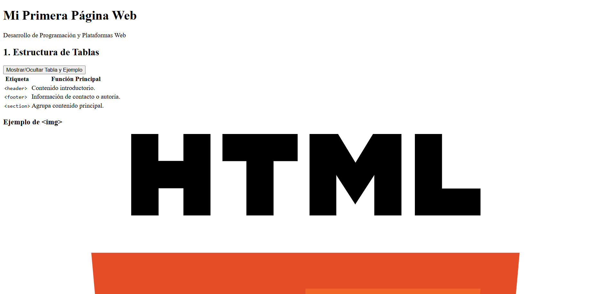
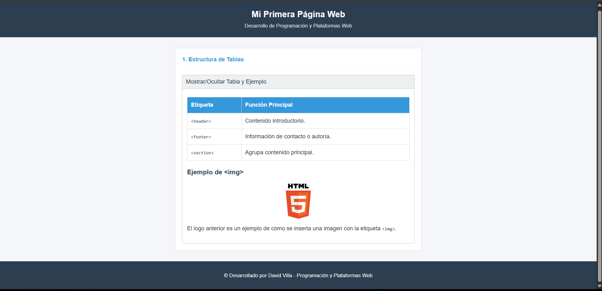

# Práctica 1 – Explorando los Estándares Web con HTML, CSS y JavaScript  

**Asignatura:** Programación y Plataformas Web  
**Unidad:** 1.2 – Estándares Web  
**Estudiante:** David Villa 
**Repositorio:** [https://github.com/Davidvillahdz/icc-ppw-u1-mi_pagina_web.git]  
**Página desplegada (GitHub Pages):** [https://davidvillahdz.github.io/icc-ppw-u1-mi_pagina_web/]
---

## 🧱 Estructura HTML utilizada

| **Componente**       | **Descripción**                     | **Implementación**                       |
|-----------------------|-------------------------------------|------------------------------------------|
| `<!DOCTYPE html>`     | Declaración del documento HTML5     | Línea 1                                  |
| `<html lang="es">`    | Idioma del documento                | Español                                  |
| `<header>`            | Encabezado principal                | Contiene `<h1>` y `<h2>`                 |
| `<section>`           | Agrupa contenido principal          | Dos secciones con `<h2>`                 |
| `<table>`             | Muestra los elementos estudiados    | Tres filas con `<th>` y `<td>`           |
| `<footer>`            | Pie de página                       | Nombre del estudiante y asignatura       |

---

## 🧩 Nuevas etiquetas exploradas

| **Elemento** | **Etiqueta HTML** | **Descripción** | **Propósito en el Proyecto** | **Código HTML** |
|---------------|------------------|------------------|-------------------------------|------------------|
| Imagen | `` | Muestra una imagen referenciada por una URL o ruta local. | Se usó para mostrar el Logo de HTML5 en la sección *Estructura de Tablas*. | `` |
| Botón | `<button>` | Elemento interactivo que ejecuta una acción. | Se usó para crear los acordeones que ocultan y muestran el contenido de cada sección, activado por *Scripts.js*. | `<button class="accordion">Mostrar/Ocultar Contenido</button>` |

---

### 💻 Ejemplo de ``

html
<h3>Ejemplo de &lt;img&gt;</h3>

El logo anterior es un ejemplo de cómo se inserta una imagen...

---
## 📸 Capturas de pantalla del proyecto final

A continuación se muestran las capturas de pantalla del proyecto final funcionando en el navegador, correspondientes a **ambas versiones**:

- 🌐 **Versión sin CSS/JS:** muestra la estructura base en HTML.  
- 🎨 **Versión con CSS y JavaScript:** muestra la página con estilos y comportamiento dinámico.

  <table>
    <tr>
      <td align="center">
        <strong>Versión sin CSS/JS</strong> 
        
      </td>
      <td align="center">
        <strong>Versión con CSS/JS</strong> 
        
      </td>
    </tr>
  </table>

